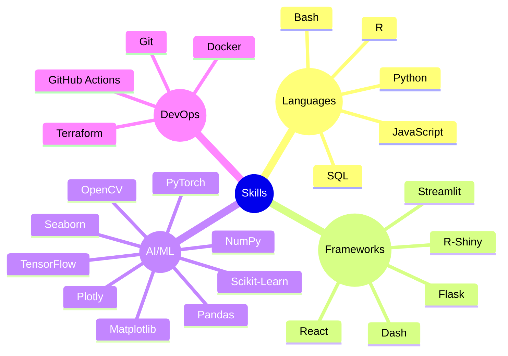

## Hi there 👋

<h1 align="center">Hi 👋, I'm Pavan Satya Krishna</h1>
<h3 align="center">A passionate data analyst looking for entry level roles</h3>

  

- 🔭 I’m currently working on [NutriWeb](https://github.com/pavansatya/NutriWeb)

- 🌱 I’m currently learning **Apache PySpark**

- 👯 I’m looking to collaborate on [building PowerBI, Tableau dashboards](https://github.com/pavansatya/Indian-Premier-League-Analysis)

- 🤝 I’m looking for help with **OpenCV, Object detection**

- 👨‍💻 All of my projects are available at [https://pavansatya.github.io/pavansatyakrishna.github.io/](https://pavansatya.github.io/pavansatyakrishna.github.io/)

- 📫 How to reach me **krishvenigalla06@gmail.com**

- 📄 Know about my experiences [https://drive.google.com/file/d/1kpaaDDAqfsetJkIrdsM9ZaQ8nTTR9v7x/view?usp=sharing](https://drive.google.com/file/d/1kpaaDDAqfsetJkIrdsM9ZaQ8nTTR9v7x/view?usp=sharing)

<h3 align="left">Connect with me:</h3>

<h3 align="left">Languages and Tools:</h3>

                    

### ⚡ Tech Snapshot

&nbsp;

