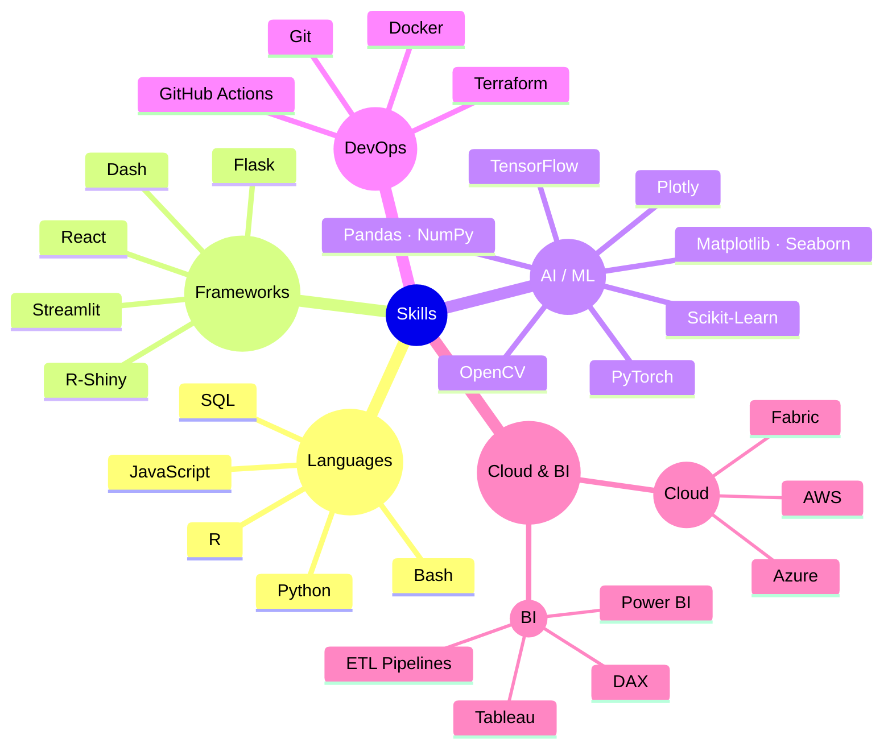

<!-- Dynamic Header -->

<!-- Typing Animation -->

 

<!-- Quick Links -->

---

## 🧬 About

> **I don't just move data from A to B — I make it mean something.**
>
> From building ETL pipelines processing millions of healthcare records at **LA County Department of Health Services**, to designing Power BI dashboards that turned raw IPL stats into stories, my work sits at the intersection of engineering and insight. I've modernized data infrastructure at **Piramal Finance**, built semantic search systems like **[NutriWeb](https://github.com/pavansatya/NutriWeb)**, and shipped predictive models across finance, healthcare, and education — always with the goal of giving stakeholders clarity, not just charts.
>
> I'm a **Rutgers** grad, **AWS certified**, and currently deep in **Apache PySpark** and large-scale distributed systems. I care most about the full arc — from messy source to clean pipeline to a dashboard that changes someone's decision.

 

🔭 &nbsp; Currently building **[NutriWeb](https://huggingface.co/spaces/Krish264/NutriWeb)** — a semantic food recommendation engine on HuggingFace

🌱 &nbsp; Leveling up in **Apache PySpark** and distributed computing

👯 &nbsp; Open to collaborating on **[Power BI & Tableau dashboards](https://github.com/pavansatya/Indian-Premier-League-Analysis)**

📄 &nbsp; **[View my Resume](https://drive.google.com/file/d/1VpCKemyjKswULXx1swBug4QJegcrHdRl/view?usp=sharing)**

---

## 🛠️ Tech Arsenal

<b>Languages & Scripting</b>

 

<b>Data & ML</b>

 

<b>Cloud & Data Platforms</b>

 

<b>BI & Visualization</b>

 

<b>Frameworks & DevOps</b>

 

<b>🧠 Skills Mindmap (click to expand)</b>

 

```mermaid
mindmap
  root((Skills))
    ((Languages))
      Python
      JavaScript
      R
      SQL
      Bash
    ((Frameworks))
      React
      Flask
      Dash
      R-Shiny
      Streamlit
    ((AI / ML))
      PyTorch
      TensorFlow
      Plotly
      Pandas · NumPy
      Matplotlib · Seaborn
      Scikit-Learn
      OpenCV
    ((DevOps))
      Git
      Docker
      GitHub Actions
      Terraform
    ((Cloud & BI))
      ((Cloud))
        Azure
        AWS
        Fabric
      ((BI))
        Power BI
        Tableau
        DAX
        ETL Pipelines
```

---

## 📌 Featured Projects

<table>
<tr>
<td width="50%" valign="top">

### 🍎 [NutriWeb](https://github.com/pavansatya/NutriWeb)
Personalized food recommendation engine powered by semantic search. Factors in health conditions (BP, cholesterol, sugar) and dietary preferences.

`Python` `NLP` `HuggingFace` `Streamlit`

</td>
<td width="50%" valign="top">

### 🏏 [IPL Analysis Dashboard](https://github.com/pavansatya/Indian-Premier-League-Analysis)
Interactive Power BI dashboard covering 15 seasons (2008–2022) of Indian Premier League data with deep-dive player and team analytics.

`Power BI` `DAX` `Data Modeling`

</td>
</tr>
<tr>
<td width="50%" valign="top">

### 💰 [Portfolio Management Tracker](https://github.com/pavansatya/Private-Equity)
Automated investment tracker that generates and emails daily portfolio performance reports.

`Python` `Automation` `Finance`

</td>
<td width="50%" valign="top">

### 🩺 [Breast Cancer Prediction](https://github.com/pavansatya/Breast-Cancer-Prediction)
Streamlit app that visualizes diagnostic features as interactive radar charts for breast cancer classification.

`Python` `Scikit-Learn` `Streamlit`

</td>
</tr>
<tr>
<td width="50%" valign="top">

### 📈 [Crypto Price Analysis](https://github.com/pavansatya/Cryptocurrency-Analysis)
Time-series forecasting model for Bitcoin price prediction using historical market data.

`Python` `Time Series` `ML`

</td>
<td width="50%" valign="top">

### 👥 [HR Analytics Dashboard](https://github.com/pavansatya/HR-Analytics-Dashboard)
Dynamic Tableau dashboard tracking workforce KPIs — attrition, demographics, satisfaction, and performance trends.

`Tableau` `HR Analytics` `Data Viz`

</td>
</tr>
</table>

---

## 📊 GitHub Activity

<picture>
  <source media="(prefers-color-scheme: dark)" srcset="https://github-readme-stats.vercel.app/api?username=pavansatya&show_icons=true&theme=github_dark&hide_border=true&bg_color=0d1117&title_color=58a6ff&icon_color=58a6ff&text_color=c9d1d9&rank_icon=github&cache_seconds=86400" />
  <source media="(prefers-color-scheme: light)" srcset="https://github-readme-stats.vercel.app/api?username=pavansatya&show_icons=true&theme=default&hide_border=true&cache_seconds=86400" />
  
</picture>
<picture>
  <source media="(prefers-color-scheme: dark)" srcset="https://github-readme-stats.vercel.app/api/top-langs?username=pavansatya&layout=compact&theme=github_dark&hide_border=true&bg_color=0d1117&title_color=58a6ff&text_color=c9d1d9&cache_seconds=86400" />
  <source media="(prefers-color-scheme: light)" srcset="https://github-readme-stats.vercel.app/api/top-langs?username=pavansatya&layout=compact&theme=default&hide_border=true&cache_seconds=86400" />
  
</picture>

  

<picture>
  <source media="(prefers-color-scheme: dark)" srcset="https://github-readme-streak-stats.herokuapp.com/?user=pavansatya&theme=github-dark-blue&hide_border=true&background=0d1117&stroke=1f6feb&ring=58a6ff&fire=58a6ff&currStreakLabel=58a6ff&cache_seconds=86400" />
  <source media="(prefers-color-scheme: light)" srcset="https://github-readme-streak-stats.herokuapp.com/?user=pavansatya&hide_border=true&cache_seconds=86400" />
  
</picture>

---

**💬 Got a project in mind? Let's build something together.**

